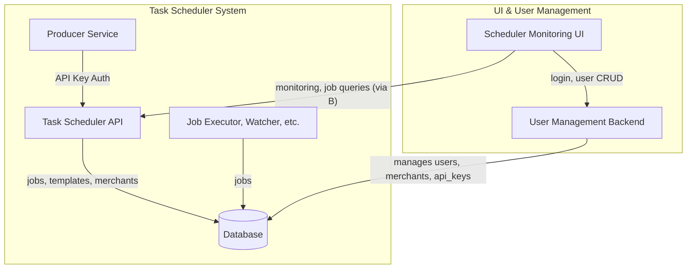

# Task Scheduler System - Functional Architecture

## System Overview

The Task Scheduler System is a distributed application designed to manage, execute, and monitor scheduled tasks with high reliability. The architecture follows microservices principles with clear functional boundaries between components.

## Functional Responsibilities

### 1. Core Shared Functionality (`scheduler_core`)

**Primary Responsibilities:**

- **Data Modeling & Validation**

  - Define and validate domain models (Jobs, Templates, Executions)
  - Serialization/deserialization for storage and transport
  - Business rule enforcement (e.g., schedule validation)

- **Data Access**

  - Database connection pooling and management
  - Common CRUD operations for all services
  - Migration management

- **Queue Operations**

  - Redis connection management
  - Atomic queue operations (push/pop/peek)
  - Priority queue implementation

- **Cross-Cutting Concerns**
  - Configuration management
  - Error handling framework
  - Logging and instrumentation
  - Health check utilities

### 2. API Service (`task_scheduler_api`)

**Primary Responsibilities:**

- **User Interface**

  - RESTful API endpoints for system interaction
  - Swagger/OpenAPI documentation
  - Authentication and authorization

- **Job Management**

  - CRUD operations for jobs
  - Immediate job execution triggers
  - Job status inspection

- **Template Management**

  - Recurrence template configuration
  - Template validation
  - Preview of generated jobs

- **System Monitoring**
  - Health endpoints
  - Metrics exposure
  - Operational alerts

### 2a. Authentication & Authorization (Updated)

**Primary Responsibilities:**

- **API Key Authentication (task_scheduler_api):**
  - All API requests to the Task Scheduler API require a valid API key in the `x-api-key` header.
  - API keys are managed in the `api_keys` table, with expiry and permissions.
  - Jobs are linked to merchants via the `merchant_id` field.
  - No user login/session management is handled by the Task Scheduler API.

- **User Management (Separate Backend/UI):**
  - Handles user onboarding, login, logout, and role management (super admin, merchant admin, merchant member).
  - Manages the `users` and `merchants` tables.
  - Issues JWTs or sessions for UI access (not used by the Task Scheduler API).

- **Multi-Tenancy:**
  - Each job and API key is associated with a merchant for tenant isolation.
  - Templates can be enabled/disabled via the `active` field.

### 3. Task Executor (`task_executor`)

**Primary Responsibilities:**

- **Job Processing**

  - Reliable queue consumption from Redis
  - Concurrent job execution with configurable parallelism
  - Timeout and resource limit enforcement

- **Execution Environment**

  - Process isolation/sandboxing
  - Dependency management
  - Output capture and storage

- **State Management**
  - Job status transitions (running → succeeded/failed)
  - Execution metadata recording
  - Heartbeat monitoring

### 4. Failure Watcher (`task_failure_watcher`)

**Primary Responsibilities:**

- **System Reliability**

  - Detection of stalled/failed jobs
  - Automatic retry with exponential backoff
  - Dead letter queue management

- **Alerting**

  - Configurable notification channels
  - Alert deduplication
  - Escalation policies

- **Cleanup**
  - Orphaned job resolution
  - Resource reclamation
  - Historical data archiving

### 5. Recurrence Manager (`task_recurrence_manager`)

**Primary Responsibilities:**

- **Schedule Expansion**

  - Template-to-job expansion
  - Complex schedule calculation (cron, intervals, calendars)
  - Exception handling (holidays, maintenance windows)

- **Temporal Management**

  - Timezone handling
  - Daylight saving adjustments
  - Bulk future job creation

- **Optimization**
  - Batch processing of templates
  - Job deduplication
  - Resource-efficient scheduling

### 6. Queue Populator (`queue_populator`)

**Primary Responsibilities:**

- **Queue Management**

  - Efficient polling of database for due jobs
  - Priority-based queue population
  - Rate limiting and throttling

- **Dependency Resolution**

  - Job dependency graph processing
  - Sequential execution enforcement
  - Conditional job evaluation

- **System Efficiency**
  - Batch Redis operations
  - Queue balancing
  - Backpressure handling

## Architecture Diagram (Updated)

## Data Flow

1. **Job Creation Path**:
   API → Database → Queue Populator → Redis → Task Executor → Database

2. **Recurring Job Path**:
   Recurrence Manager → Database → Queue Populator → Redis → Task Executor

3. **Failure Handling Path**:
   Task Executor → Database → Failure Watcher → (Retry or Alert)

4. **Monitoring Path**:
   All Services → Metrics → API → Dashboard

## Key Architectural Decisions

1. **Separation of Concerns**:

   - Clear boundaries between scheduling, execution, and monitoring
   - Independent scaling of components

2. **Reliability Patterns**:

   - At-least-once delivery semantics
   - Retry queues with exponential backoff
   - Comprehensive state tracking

3. **Performance Considerations**:

   - Batch processing where possible
   - Redis for low-latency queue operations
   - Read/write optimization through separation

4. **Observability**:
   - Unified logging format
   - Standardized metrics
   - Health checks at all levels

This architecture provides a robust foundation for a distributed task scheduling system with clear functional responsibilities and well-defined interaction patterns between components.
